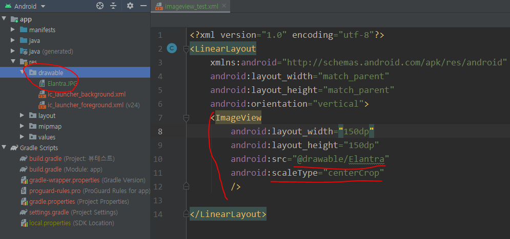
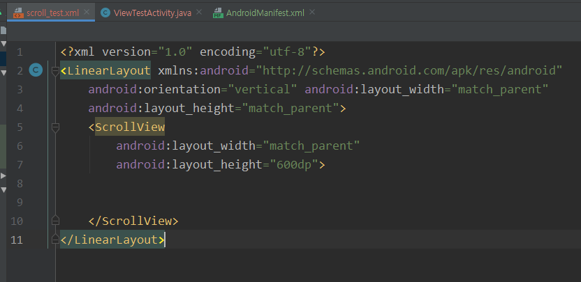
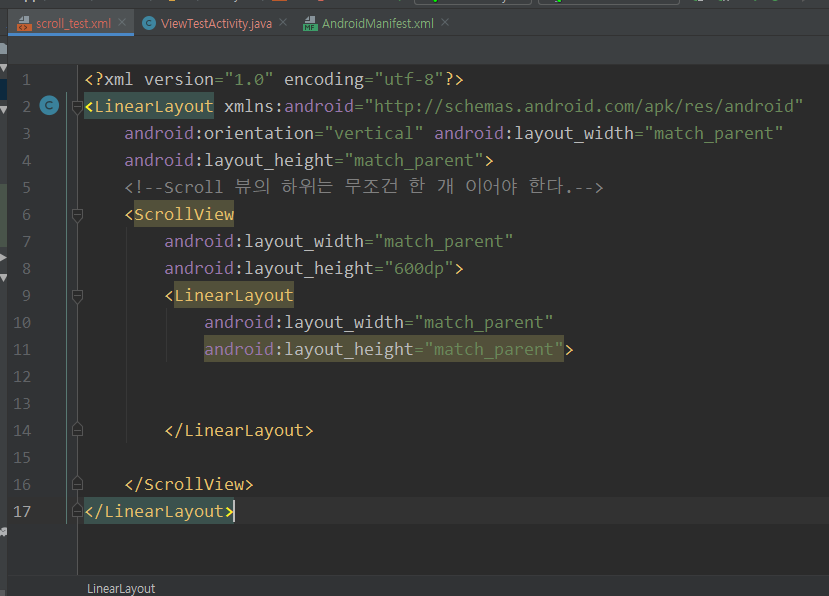
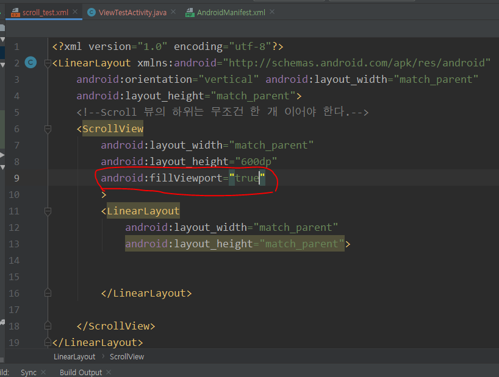

## View 만들기

#### 사진 올리기

Drawable 폴더에 사진을 넣고 <ImageView>를 이용해서 사진을 띄운다.

src를 통해 경로를 지정 / scaleType으로 사진형식 지정(바둑판, 늘이기 등) - 보통 centerCrop을 사용

#### 사진의 동적 움직임 구현

#### Scroll 뷰 구현하기

Scroll 뷰의 하위는 무조건 한 개 이어야 한다. 따라서,

ScrollView 내부에 LinearLayout을 정의한 뒤 필요한 기능을 구현해야 한다.

ScrollView를 사용할 때 항상 추가해야하는 소스 - 하위에 작업한 뷰를 표시해주는 기능

