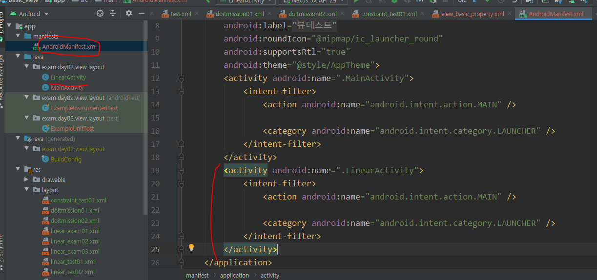

## 안드로이드 스튜디오 - View 세팅하기

layout_width : view의 너비

layout_height : view의 높이

layout_weight : Layout 내부 파레트의 비율을 설정한다.

layout_gravity : Parent 내부 View정렬 체크박스로 설정할 수 있다.

gravity : View내부에서의 정렬 ex) Button 내부 글자 위치 설정

orientation : 배치방향

id : 각 위젯을 식별할 수 있는 이름

margin : 주위여백

padding :  내부 컨텐츠와 border 사이의 간격

LinearLayout : 앱을 만들 때 기본적으로 사용하는 레이아웃 메소드

match_parent : 부모 사이즈와 동일한 사이즈(부모 사이즈 : Layout 전체 사이즈)

wrap_content : 버튼, 텍스트 등 원래 본인의 사이즈

res : Activity 이외의 정적인 데이터를 관리하는 파일

xml파일을 Rename할 때는 위 방법으로 Rename해야 한다.

dp : 안드로이드의 단위, 웹의 px 개념

화면 크기가 달라지면 깨질 수 있기 때문에 match_parent, wrap_content 써야 한다.

LinearLayout 내부에 LinearLayout를 추가해서 다른 방향의 Layout을 정의할 수 있다.

EX) LinearLayout1 : Vertical 방향 / LinearLayout2 : Horizontal 방향

완성한 화면을 Activity를 통해 출력하기 위해서는 Manifest의 xml파일에 Activity를 등록해야 한다.

"android:id"를 정의하여 다른 화면에서 참조할 수 있게 만들어 준다. 

- id : 식별자를 직접 줄 때

- android : 내부에서 주는 필드값을 참조해서 쓸 때

- TextView id 설정 후 다른 화면에서 내용 수정하기

  => '나의 문자열'로 저장되어 있던 TextView가 '안녕'으로 바뀌었다.

  

File-Setting에서 Auto Import를 설정하여 자동으로 import할 수 있다.

