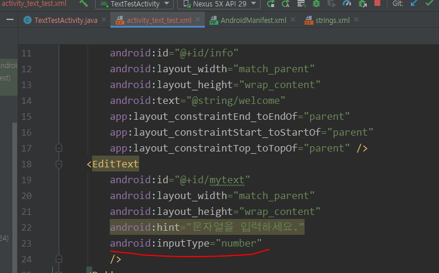
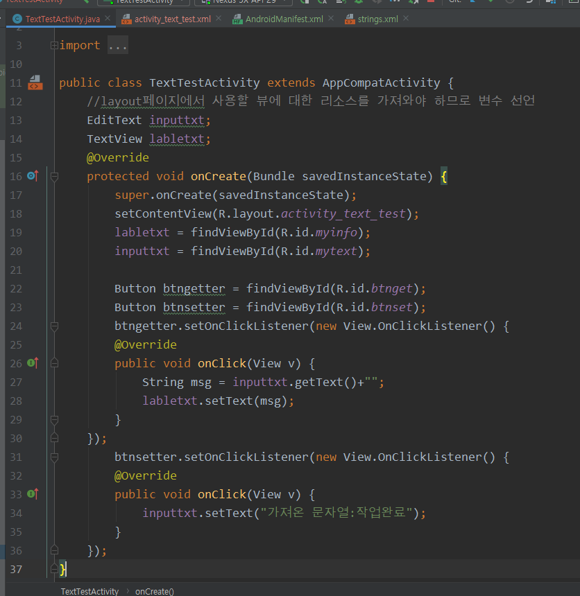

## 안드로이드 구성하기

#### 서식(도형,선,테두리)넣기

#### 입력텍스트창 만들기

strings.xml에 문자를 설정하고 layout에서 설정한 문자를 불러올 수 있다.

inputType을 통해 기본 자판을 숫자형식으로 바꿀 수 있다.

이벤트 발생시키기 : layout에서 정의한 구성요소를 기반으로 액티비티에 이벤트를 발생시킬수 있다.